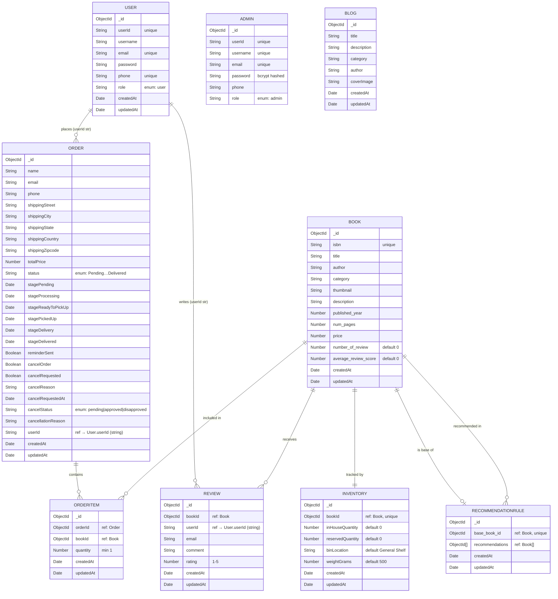

# MongoDB ERD — Bookstore Graduation Project

> **9 collections** extracted from Mongoose schemas.  
> Solid lines = `ObjectId` references · Dashed lines = loose string-based joins (e.g., `userId: String`, `email: String`).

## Collection Summary

| Collection | Key Relationships | Notes |
|---|---|---|
| `users` | → orders, reviews | String `userId` foreign key |
| `admins` | _(standalone)_ | Separate auth collection |
| `books` | → orderitems, reviews, inventory, recommendationrules | Core catalog |
| `orders` | ← users, → orderitems | Full shipping + lifecycle tracking |
| `orderitems` | → orders, → books | Junction table |
| `reviews` | → books, → users | Rating 1–5 |
| `inventories` | → books (1-to-1) | Stock & warehouse info |
| `recommendationrules` | → books (base + array) | AI-generated MBA rules |
| `blogs` | _(standalone)_ | Editorial content, no FK |

## ID Field Notes

| Collection | `_id` usage | `userId` usage |
|---|---|---|
| `users` | Used by `findByIdAndDelete` (admin delete) | Firebase UID — FK in orders, reviews, RFM |
| `admins` | MongoDB internal PK | Admin identifier |
| `orderitems` | — | Uses ObjectId refs to Order & Book |
| All others | MongoDB internal PK | N/A |
